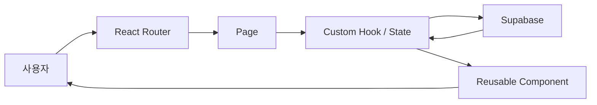

# B4-2 Round 01 — Beginner Guide

구분: **선택 미션 (OPTIONAL)**  
현재 모드: **Phase A — REFERENCE BUILD**

> 지금은 React/Supabase 기준 구현과 학습·검증 경로를 준비합니다. 실제 Supabase와 배포 검증은 Phase C에서 한 단계씩 수행합니다.

## 00. 미션 한눈에 보기

B4-2는 React SPA에서 **라우팅 → 컴포넌트 → 상태 → 이벤트 → 원격 데이터 → 렌더링** 흐름을 이해하는 미션입니다.

Reference는 `Study Cards` 서비스를 사용합니다.



## 01. 무엇을 만드는가

- 홈
- 학습 카드 목록
- 상세
- 등록
- 수정
- 삭제
- 소개
- Not Found

모든 CRUD의 원본 데이터는 Supabase `items` 테이블입니다.

## 02. 평가 핵심

- 5개 이상 route + Not Found
- 원격 CRUD
- pages/components/hooks 또는 lib 분리
- 8개 이상 재사용 컴포넌트
- custom hook 1개 이상
- loading/error/empty 공통 UI
- controlled form + validation + submitting
- state 변화가 render 변화로 이어지는 지점 3개 이상
- 실제 배포 URL의 CRUD

## 03. 핵심 용어

### SPA (Single Page Application)
페이지 전체를 다시 받기보다 React가 화면 컴포넌트를 교체하는 웹 앱입니다.

### Props
부모가 자식 컴포넌트에 전달하는 입력값입니다.

### State
사용자 입력, 서버 응답, 로딩 상태처럼 바뀌며 화면을 다시 렌더링하게 하는 값입니다.

### Controlled Input
input의 값을 React state가 관리하는 방식입니다.

### useEffect
렌더링 이후 원격 데이터 요청 같은 side effect를 실행하는 Hook입니다.

### Custom Hook
반복되는 React state/effect 로직을 `use...` 함수로 분리한 것입니다.

### Supabase
B4-2에서 원격 DB CRUD를 제공하는 backend 서비스로 선택했습니다.

## 04. Reference 구조

```text
reference/
├── .env.example
├── package.json
├── supabase-schema.sql
├── vercel.json
└── src/
    ├── pages/
    ├── components/
    ├── hooks/
    └── lib/
```

## 05. Routes

```text
/                   홈
/items              목록
/items/new          등록
/items/:id          상세
/items/:id/edit     수정
/about              소개
*                   Not Found
```

## 06. 재사용 컴포넌트

Reference는 다음 10개를 사용합니다.

`Button`, `Input`, `TextArea`, `Card`, `LoadingState`, `ErrorState`, `EmptyState`, `Layout`, `ItemCard`, `ItemForm`.

페이지는 기능 흐름을 조립하고, 반복되는 UI는 컴포넌트로 분리합니다.

## 07. Custom Hook

### `useItems()`
목록의 `items/loading/error/reload`를 관리합니다.

### `useItemDetail(id)`
라우트 ID가 바뀌면 해당 상세 데이터를 다시 요청합니다.

두 Hook 모두 `useEffect`를 이용해 React lifecycle과 원격 요청을 연결합니다.

## 08. 상태 → 화면 변화

Reference에서 최소 다음 네 곳이 분명합니다.

1. 검색 input → `query` → 목록 필터
2. Form input → `values` → 미리보기
3. 제출 시작 → `submitting` → 버튼 비활성/`저장 중…`
4. 원격 요청 → loading/error/data → Loading/Error/Empty/Data UI

## 09. Supabase 준비 — Phase C

Supabase 프로젝트를 만든 뒤 SQL Editor에서:

```text
reference/supabase-schema.sql
```

을 실행합니다.

그다음:

```bash
cd training/round-01-clear/reference
cp .env.example .env
```

`.env`에 실제 URL과 anon key를 로컬에서 입력합니다. Service Role Key는 frontend에 사용하지 않습니다.

## 10. 로컬 실행 — Phase C

```bash
npm install
npm run dev
```

브라우저에서 Vite가 표시하는 URL을 엽니다.

## 11. 실제 CRUD 순서 — Phase C

```text
목록 empty 확인
→ 새 카드 등록
→ 상세 확인
→ 목록 재확인
→ 수정
→ 수정 결과 확인
→ 삭제
→ 빈/갱신 목록 확인
```

모든 데이터는 Supabase 원격 테이블 기준으로 검증합니다.

## 12. Form UX

빈 제목/내용/카테고리를 제출하면 입력 오류가 화면에 표시되어야 합니다.

저장 요청 중에는 버튼이 비활성화되고 `저장 중…`으로 바뀝니다. 원격 요청 실패 시 사용자에게 오류 문구를 보여줍니다.

## 13. 로딩/에러/빈 상태

페이지마다 별도 UI를 복사하지 않고:

- `LoadingState`
- `ErrorState`
- `EmptyState`

를 공통으로 사용합니다.

## 14. Reference 정적 검증

Round 디렉터리 기준:

```bash
bash environment/verify.sh
```

route 수, Not Found, 8+ component, custom hook, remote CRUD, form state, secret-like pattern 등을 확인하도록 설계했습니다.

실제 실행하지 않았으므로 현재 PASS로 간주하지 않습니다.

## 15. 배포 — Phase C

Vercel 또는 Netlify에 배포하고 dashboard에 다음 환경변수를 설정합니다.

- `VITE_SUPABASE_URL`
- `VITE_SUPABASE_ANON_KEY`

배포 URL에서 목록/상세/등록/수정/삭제와 직접 route 접근을 모두 다시 확인합니다.

`vercel.json`에는 SPA route fallback용 rewrite를 준비했습니다.

## 16. 자주 발생하는 오류

### 화면에 Supabase 오류
`.env` URL/key, table 이름 `items`, SQL policy를 확인합니다.

### 직접 `/items/1` 접속 시 404
배포 플랫폼의 SPA rewrite 설정을 확인합니다.

### 등록은 되지만 목록이 안 보임
SELECT policy와 `useItems()`의 error state를 확인합니다.

### Form 버튼이 계속 저장 중
submit catch 경로에서 `submitting`을 false로 돌리는지 확인합니다.

## 17. Evidence / CLEAR

실제 Evidence 목록은 `evidence/README.md`, 평가 답변은 `docs/evaluation-qa.md`를 사용합니다.

```text
Reference 준비
+ 실제 Supabase remote CRUD
+ React 상태/UI 검증
+ production build
+ 실제 외부 URL CRUD
+ Evidence
+ 평가 설명
= ✅ B4-2 CLEAR
```

현재는 Runtime 전이므로 CLEAR가 아닙니다.
